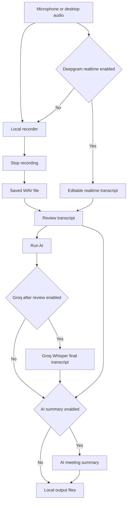

# Realtime-Meeting-Speech-To-Text-AI-Summary-Recorder

<p align="center">
  
</p>

**RMS AI Recorder** is a desktop meeting recorder for realtime speech to text, final audio transcription, and AI-generated meeting summaries.

It records microphone and desktop loopback audio, streams realtime transcription through Deepgram, saves a local WAV when recording stops, lets you review the realtime transcript, and can run Groq Whisper plus AI summary generation when you click Run AI.

> **Windows-first:** Desktop/system audio capture is currently Windows-only through WASAPI loopback. Cross-platform system audio would require separate backends such as ScreenCaptureKit on macOS and PipeWire or PulseAudio on Linux.

## Features

- Realtime meeting speech to text with Deepgram.
- Desktop loopback recording through WASAPI on Windows.
- Microphone input recording with selectable input devices.
- Optional output device selection for loopback capture.
- Local WAV recording for final post-processing.
- Optional Groq Whisper transcription after transcript review.
- Optional AI meeting summary from reviewed realtime and final transcripts.
- OpenAI-compatible summary API support.
- API credential check buttons for Deepgram, Groq, and summary provider.
- Auto-save settings with debounce in the desktop app.
- Configurable output directory, file names, models, language, and prompt.
- Dark mode desktop interface built with egui.

## Tech Stack

| Layer | Stack |
| ----- | ----- |
| Desktop UI | Rust, eframe, egui |
| Async Runtime | Tokio |
| Audio Capture | WASAPI capture and render devices on Windows |
| WAV Processing | hound |
| Realtime transcription | Deepgram WebSocket API |
| Final transcription | Groq Whisper API |
| AI Summary | OpenAI-compatible Chat Completions API |
| HTTP Client | reqwest |
| Config | JSON via serde and serde_json |
| Local Paths | directories |

## Project Structure

```text
.
├── src/                    # RMS AI Recorder desktop app
│   ├── main.rs
│   ├── logger.rs
│   ├── app/                # egui state, workflow, views, persistence, and widgets
│   ├── audio/              # recorder, analysis, and WASAPI loopback
│   └── services/           # Deepgram, Groq, summary, credential checks
├── assets/                 # Windows app icon
├── build.rs                # Windows icon resource embedding
├── settings.example.json   # public config template
├── Packager.toml           # Windows installer packaging config
├── Cargo.toml
└── README.md
```

The desktop GUI app is the only application path in this repository.

## Configuration

Installed desktop app:

```text
%LOCALAPPDATA%\rms-ai-recorder\settings.json
```

Local development:

```text
settings.json
```

Use the example file as a starting point:

```bash
cp settings.example.json settings.json
```

Main configuration fields:

| Key | Description |
| --- | ----------- |
| `enable_deepgram` | Enable realtime Deepgram transcription |
| `auto_groq` | Run Groq Whisper transcription after transcript review |
| `enable_summary` | Generate AI summary after transcript review |
| `input_device_names` | Selected microphone/capture devices; use `Default` for the default input device, or leave empty when only system audio is selected |
| `output_device_names` | Selected system/loopback output devices; use `Default` for the default output device, or leave empty when only microphone input is selected |
| `deepgram_api_key` | Deepgram API key |
| `groq_api_key` | Groq API key |
| `summary_api_key` | OpenAI-compatible API key |
| `summary_base_url` | OpenAI-compatible API base URL |
| `deepgram_model` | Deepgram realtime model |
| `groq_model` | Groq Whisper model |
| `summary_model` | Chat completion model for summary |
| `language` | Transcription language code |
| `output_dir` | Output folder for generated files |
| `output_prefix` | Optional prefix for generated output files |
| `summary_prompt` | Custom prompt used for AI meeting summaries |
| `dark_mode` | Enable dark UI theme |

The desktop app auto-saves settings after edits. Select `Default` to use the OS default microphone or system output device. Either input or output can be empty, but at least one audio source must stay selected.

## Getting Started

### Prerequisites

- [Rust](https://www.rust-lang.org/tools/install)
- Windows for WASAPI loopback recording
- Deepgram API key for realtime transcription
- Groq API key for final Whisper transcription
- OpenAI-compatible API key for AI summary generation

### Setup

1. Clone the repository:

```bash
git clone https://github.com/Hilmi-Raif/Realtime-Meeting-Speech-To-Text-AI-Summary-Recorder.git
cd Realtime-Meeting-Speech-To-Text-AI-Summary-Recorder
```

2. Create local settings:

```bash
cp settings.example.json settings.json
```

3. Fill the API keys in `settings.json`:

```json
{
  "deepgram_api_key": "your_deepgram_api_key_here",
  "groq_api_key": "your_groq_api_key_here",
  "summary_api_key": "your_openai_compatible_api_key_here"
}
```

4. Run the desktop app:

```bash
cargo run
```

5. Build the desktop app:

```bash
cargo build --release
```

## Commands

| Command | Description |
| ------- | ----------- |
| `cargo run` | Run RMS AI Recorder desktop app |
| `cargo build --release` | Build RMS AI Recorder desktop app |
| `cargo packager --release --formats nsis` | Build the Windows NSIS installer |
| `cargo test` | Run tests |
| `cargo check` | Check the app crate |

## Output Files

The app can generate several local files depending on enabled options:

| File | Description |
| ---- | ----------- |
| `record.wav` | Local recorded audio |
| `transcript_log.txt` | Realtime transcript log |
| `transcript_whisper.txt` | Final Groq Whisper transcript |
| `summary.txt` | AI-generated meeting summary |

By default, audio is written under `outputs\audio`. Transcripts and summaries are written under `outputs\transcripts`. Output file names and the output folder are configurable in settings.

## Transcription Flow



Deepgram is used for realtime transcript visibility during a meeting. Stop saves the WAV file and opens a review stage where the realtime transcript remains editable. Groq Whisper runs only after you click Run AI, producing a final transcript from the saved WAV file. The AI summary uses the reviewed realtime transcript plus Groq final text when available.

## API Credential Checks

The settings dialog includes credential check buttons for:

| Provider | Check |
| -------- | ----- |
| Deepgram | Opens a lightweight realtime WebSocket connection |
| Groq | Checks model accessibility through the models endpoint |
| Summary API | Sends a tiny chat completion request |

These checks verify connectivity and model access. They do not guarantee provider credit or quota availability because each provider exposes billing and quota differently.

## Data Storage

```text
%LOCALAPPDATA%\rms-ai-recorder\settings.json
%LOCALAPPDATA%\rms-ai-recorder\outputs
```

Updates keep local settings and recordings. Uninstall removes local app data only when the cleanup option is selected.

## Notes

- Desktop/system audio recording is currently Windows-only through WASAPI loopback.
- Microphone capture and desktop/system audio recording currently use WASAPI devices.
- macOS and Linux desktop audio need separate native backends.
- Keep `settings.json` private if it contains real credentials.
- Use `settings.example.json` for sharing safe example configuration.
